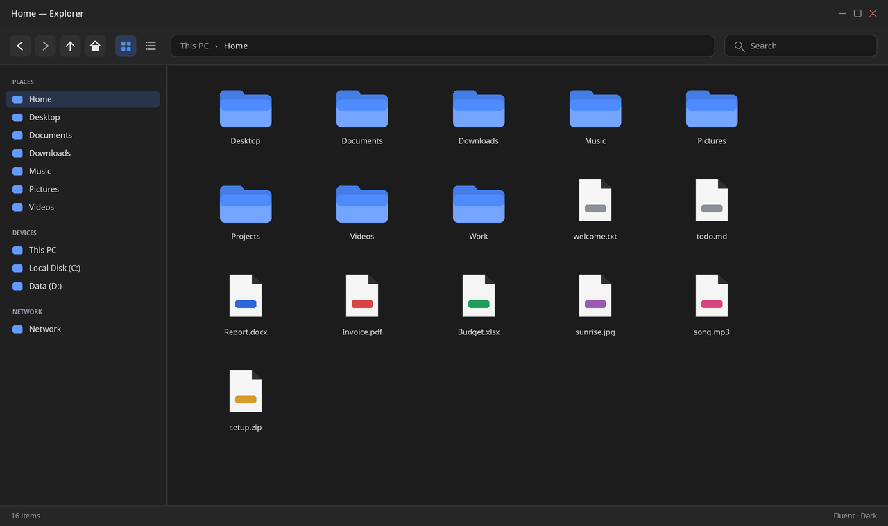
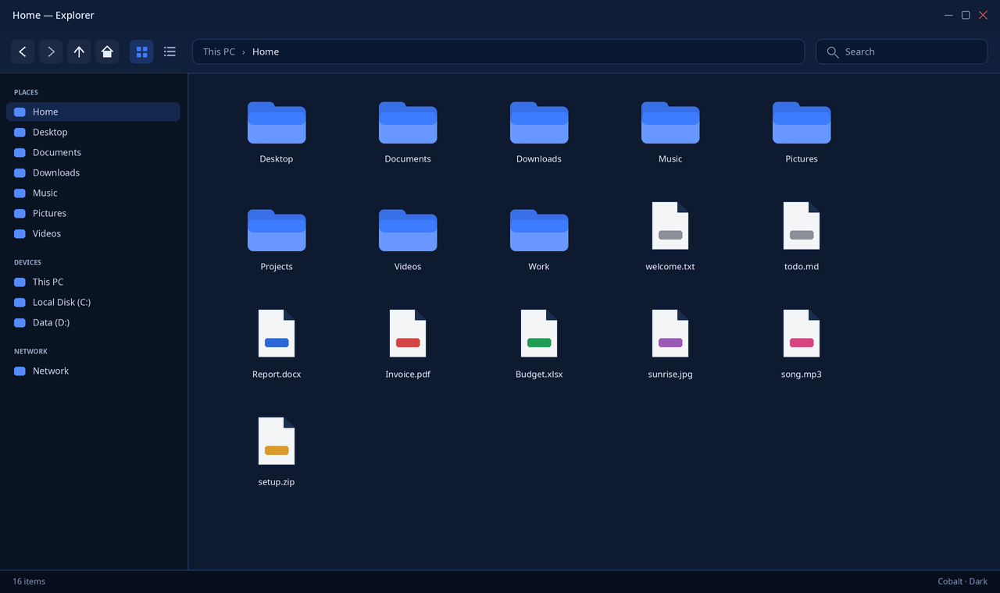
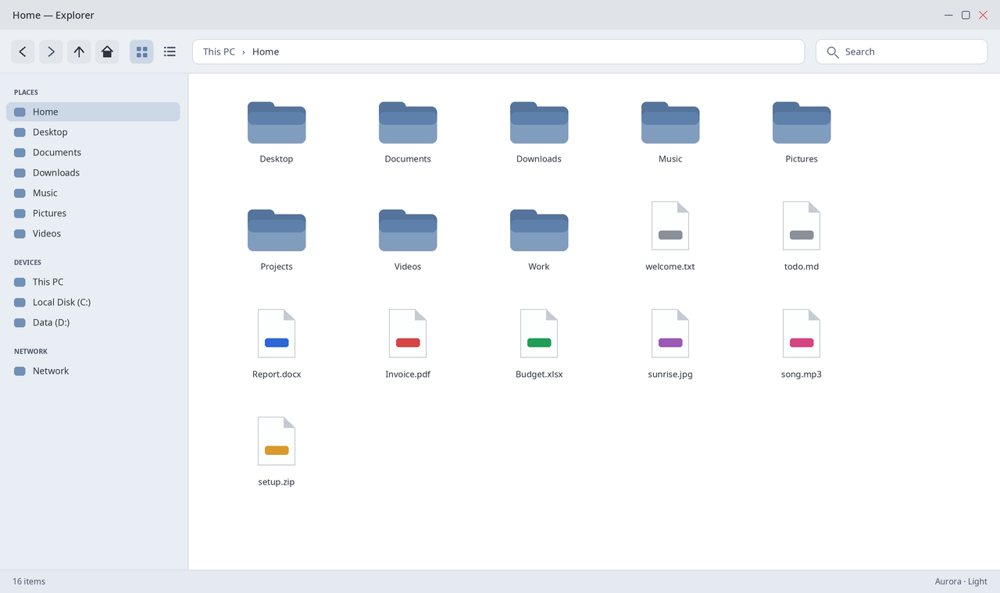
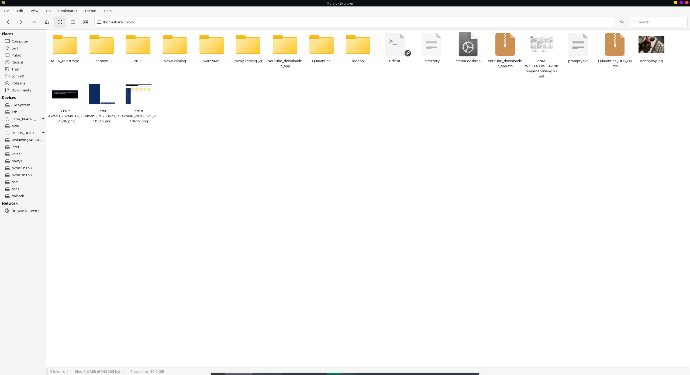

# Explorer — a Windows 11–style file manager on the Thunar engine

A fork of **Thunar 4.20.8** rebranded as a standalone app called **"Explorer"**,
with a dark Windows 11 theme, Windows-like defaults and an always-visible search
box in the toolbar. It runs **alongside** the system Thunar without overriding it.

## Screenshots

The "Theme" menu ships **8 palettes** (Fluent / Aurora / Porcelain / Cobalt, each
in Dark and Light), switchable live. A few of them:

| Fluent · Dark | Cobalt · Dark |
| --- | --- |
|  |  |
| **Aurora · Light** | **Porcelain · Light** |
|  |  |

The screenshots show the CSD **header bar** (menu in the title bar), the
**breadcrumb path bar**, the always-visible **Search** box, Finder-style
**color labels** (icon view and full rows in the details view), exact
**date + time** in the Date Modified column, and the right-hand **image
preview pane** (`Ctrl+4`) — all on a Windows-style Places/Devices sidebar.

> The images above are representative **mockups** generated on sample data
> (`scripts/gen-mockups.py`) — no personal files. To capture real screenshots
> from the running app, use `scripts/gen-screenshots.sh`.

## Features

- **Look:** built-in Windows 11 theme (GTK CSS), forced independently of the
  system GTK theme; window title "Explorer". English UI regardless of locale.
- **Themes:** a "Theme" menu in the menu bar — 8 palettes (Fluent / Aurora /
  Porcelain / Cobalt × Dark / Light) ported from a sibling Python Explorer;
  live switching, stored in the `explorer` Xfconf channel (`/explorer-theme`).
  Generated by `scripts/gen-themes.py`.
- **Windows-like defaults:** large 150% icons with thumbnails, thumbnails set to
  "always" with no size limit (built for thousands of photos — cached by
  `tumbler`), folders first, double-click, full date **and time** everywhere
  (`03.07.2026 20:08` in Properties and the Date Modified column).
- **Search:** an always-visible "Search" box at the top-right of the toolbar
  (like Windows) plus Thunar's native recursive search (also `Ctrl+F`).
- **Windows-style chrome:** client-side header bar (CSD) with the menu in the
  title bar, a breadcrumb path bar (click `Ctrl+L` to type a path), a right-hand
  image **preview pane**, Undo/Redo toolbar buttons, and folders opening as
  **tabs** in the existing window.
- **Computer:** a "Computer" sidebar entry (`computer://`, needs `gvfs`) lists
  all drives — the closest equivalent of Windows' "This PC".
- **Color labels (Finder-style):** right-click selected files → **Color Label**
  (Red/Orange/Yellow/Green/Blue/Purple/Gray, None to clear). Stored as gvfs
  metadata (Thunar's file-highlight feature), rendered in every view.
- **Quick preview:** `Ctrl+4` toggles the right-hand image preview pane (the
  closest analogue of Finder's Gallery view; Ctrl+1/2/3 switch the views).
- **Hidden files** shown by default. **Icons:** Win11-dark (light themes → Win11),
  with a graceful fallback to an installed theme (e.g. `breeze`) when absent.
- **Terminal:** right-click in a folder → "Open Terminal Here" tries `konsole`,
  then `xfce4-terminal`, `gnome-terminal`, `x-terminal-emulator`, `xterm` —
  whichever is installed first. Right-click a file → **"Open in Terminal"**
  runs it in a terminal window (scripts without `+x` run via `sh`) and keeps
  the window open with the exit code.
- **All drives:** `scripts/enable-gvfs-drives.sh` (sudo) adds `x-gvfs-show` to
  `/mnt/*` fstab entries so every disk appears under "Devices".
- **Isolation:** its own application id `io.github.quzopl.Explorer` and its own Xfconf
  settings channel `explorer`.

## Building from scratch

**Build** requirements: a GTK3/XFCE toolchain (on Arch/Manjaro: `gtk3 libxfce4ui
libxfce4util exo xfconf gudev`), `gcc`, `make`, `patch`, `curl`, `tumbler`
(thumbnails).

**Runtime** requirements (Arch/Manjaro):

- `gvfs` + `gvfs-smb` — **required for network drives** (`smb://`, `sftp://`) and
  the "Network" sidebar entry; also removable-device mounting. Optional:
  `gvfs-mtp` (phones), `gvfs-nfs` (NFS).
- any terminal emulator for "Open Terminal Here" (`konsole`, `xfce4-terminal`,
  `gnome-terminal`, `x-terminal-emulator` or `xterm`).
- a `Win11` / `Win11-dark` icon theme (optional) — for the Windows look; without
  it the app falls back to an installed theme (e.g. `breeze`).

```bash
bash scripts/fetch-sources.sh     # download Thunar 4.20.8 into thunar-src/
bash scripts/apply-patches.sh     # apply patches/01..26
bash scripts/build.sh             # ./configure + make + make install -> install/
bash scripts/install-branding.sh  # explorer binary, .desktop, icon, themes
```

Run it: `./install/bin/explorer`

### Network drives

There is no "Connect to Server" dialog (this is Thunar). Install `gvfs gvfs-smb`,
then press **Ctrl+L** and type a URL, e.g. `smb://server/share` or
`sftp://host/path`; drag the opened folder onto the sidebar to bookmark it. Local
`/mnt/*` disks: run `sudo bash scripts/enable-gvfs-drives.sh`.

### Building the AppImage

Requires `linuxdeploy`, `linuxdeploy-plugin-gtk.sh` and `appimagetool` in `PATH`:

```bash
bash scripts/build-appimage.sh    # -> dist/Explorer-x86_64.AppImage
```

### Upgrading an existing install

Thunar persists `last-*` settings on exit, so an existing `explorer` Xfconf
channel keeps the old toolbar/path-bar layout. To pick up the new defaults
(breadcrumbs, Undo/Redo buttons, preview pane) reset them once:

```bash
xfconf-query -c explorer -p /last-toolbar-items -r
xfconf-query -c explorer -p /last-location-bar -r
```

## Verification

```bash
bash scripts/verify-etap1.sh   # foundation: separate app-id, alongside system Thunar
bash scripts/verify-etap2.sh   # look: theme palettes installed, starts without errors
bash scripts/verify-etap3.sh   # toolbar search box
```

## Layout

- `thunar-src/` — Thunar sources (git-ignored; reproducible from the tarball).
- `patches/` — every C change (reproducible after `fetch-sources.sh`).
- `branding/` — `explorer.desktop`, `explorer.svg` (app icon), `themes/*.css`
  (8 palettes).
- `scripts/` — fetch, patch, build, branding, AppImage, drives, verification.
- `docs/superpowers/` — design specs and implementation plans.

Optional video thumbnails: `sudo pacman -S ffmpegthumbnailer` — `tumbler` picks
it up automatically.

## How it works

All C changes live in `patches/01..26` and are applied on top of a pristine
Thunar 4.20.8 tree. Highlights: separate application id and Xfconf channel,
forced dark Win11 CSS, default large icons + always-on thumbnails, an
always-visible search entry wired to Thunar's native search, a theme switcher,
hidden files on by default, a working "Open Terminal Here" with a terminal
fallback chain, a forced English UI, Windows-like defaults (breadcrumb path bar,
preview pane, undo/redo buttons, open-as-tabs) and a CSD header bar. The Thunar source tree itself is never committed.
